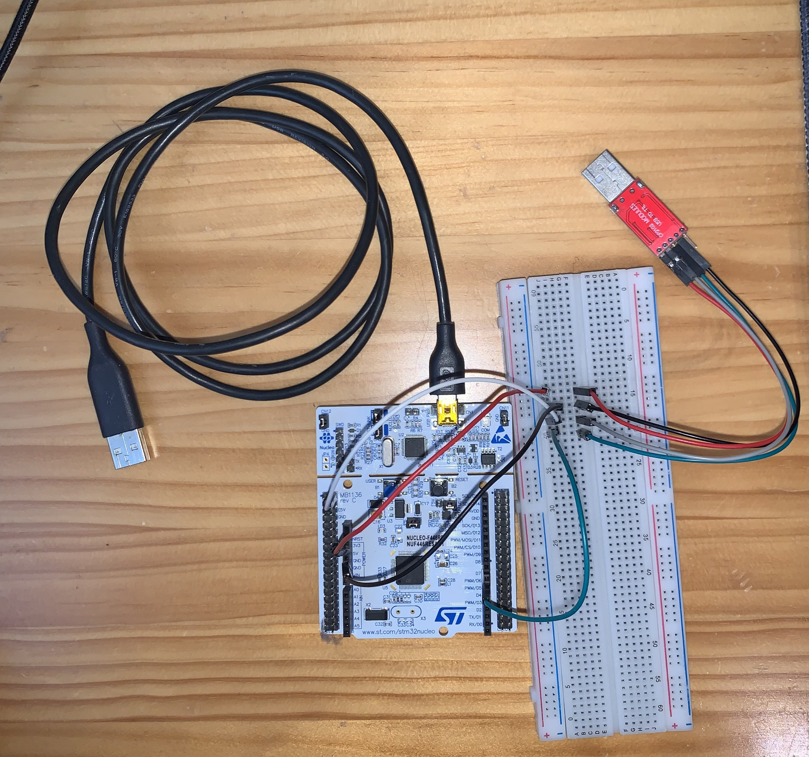
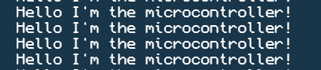
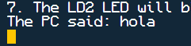
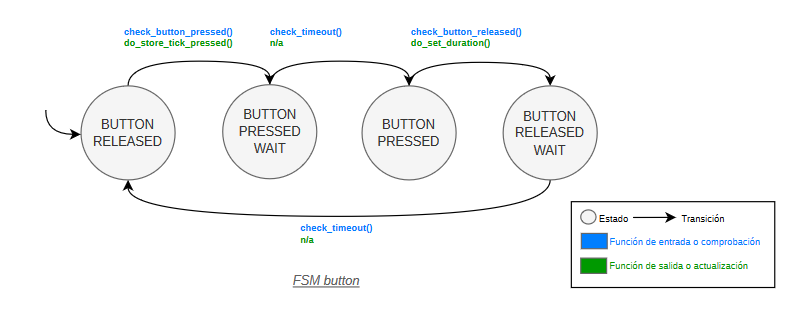
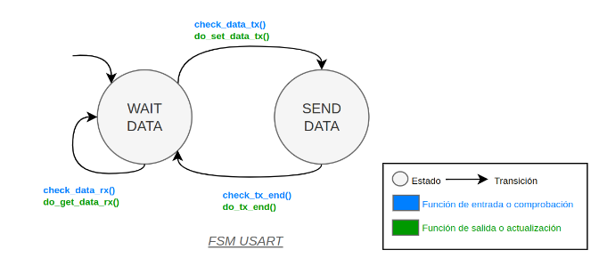

# Juxebox V1 y V2

## Authors

* **Pablo Morales Escandón** - email: [pablo.morales@alumnos.upm.es](mailto:pablo.morales@alumnos.upm.es)
* **Noel Solís Verdesoto** - email: [alumno@alumno.es](mailto:alumno@alumno.es)

Desarrollo de un programa capaz de emitir melodías por un Buzzer en la placa Nucleo-STM32. A futuro aún no hemos decidido que más implementaremos.

**Montaje actual:**

Por ahora unicamente es capaz de recibir y enviar información por la interfaz UART y de detectar pulsaciones del botón de usuario.

### Desmotración
Usando el programa de test proporcionado podemos ver que la placa es capaz de detectar la pulsación del botón y enviar por la terminal serie (mediante la interfaz UART) un mensaje.

A su vez la placa es capaz de leer un mensaje enviado por el ordenador, en este caso imprime el contenido leído a la terminal.  

  

  

## Version 1
Desarrollo del código para un botón.

- Se desarrolla el código completo para un solo botón (el de usauario) pero preparado para la implementación de más botones.
- Se implementa además un sistema anti-rebotes (debounce).
- Se hace uso de una máquina de estados (FSM) para contolar el estado del botón.

### Common
Desarrollo de la librería common (de uso general).

* [fsm_button.h](fsm__button_8h.html).
* [fsm_button.c](fsm__button_8c.html).

Se implementa la FSM acorde a la siguiente tabla:

### Port
Desarrollo del código específico a la placa.

* [port_button.h](port__button_8h.html).
* [port_button.c](port__button_8c.html).

## Version 2
Desarrollo del código para hacer uso de la interfaz UART para recibir y enviar información al ordenador.

- Se desarrolla el código completo para la UART 3 pero preparado para la implementación de más UART si es necesario.
- Se hace uso de una máquina de estados (FSM) para contolar los estados de la UART.

### Common
Desarrollo de la librería common (de uso general).

* [fsm_usart.h](fsm__usart_8h.html).
* [fsm_usart.c](fsm__usart_8c.html).

Se implementa la FSM acorde a la siguiente tabla:

### Port
Desarrollo del código específico a la placa.

* [port_usart.h](port__usart_8h.html).
* [port_usart.c](port__usart_8c.html).

## Version 3
**WIP**

## Version 4
**WIP**

## Version 5
**WIP**

