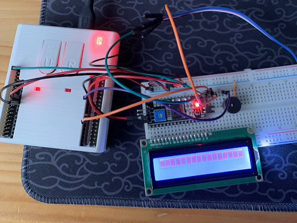
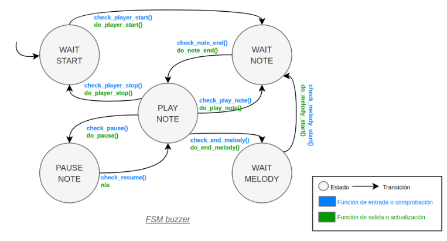
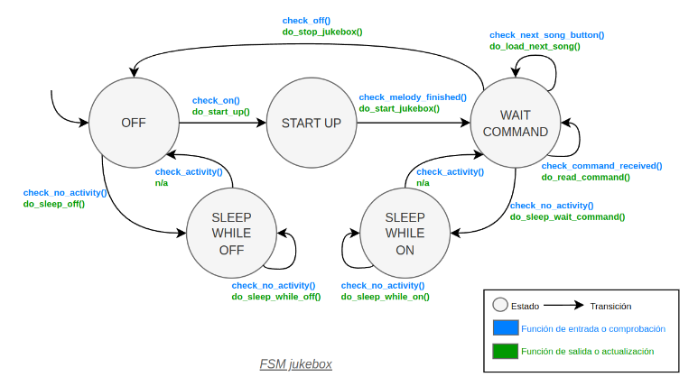

# Jukebox V1, V2, V3 y V4

## Authors

* **Pablo Morales Escandón** - email: [pablo.morales@alumnos.upm.es](mailto:pablo.morales@alumnos.upm.es)
* **Noel Solís Verdesoto** - email: [alumno@alumno.es](mailto:noel.solis@alumnos.upm.es)

Desarrollo de un programa capaz de reproducir melodías almacenadas en memoria usando un Buzzer controlado por la placa Nucleo-STM32 que se comunica con un ordenador a través de un módulo USART. 

**Montaje actual:**

## Version 1
Desarrollo del código para un botón.

- Se desarrolla el código completo para un solo botón (el de usauario) pero preparado para la implementación de más botones.
- Se implementa además un sistema anti-rebotes (debounce).
- Se hace uso de una máquina de estados (FSM) para contolar el estado del botón.

### Common
Desarrollo de la librería common (de uso general).

* [fsm_button.h](fsm__button_8h.html).
* [fsm_button.c](fsm__button_8c.html).

Se implementa la FSM acorde a la siguiente tabla:

### Port
Desarrollo del código específico a la placa.

* [port_button.h](port__button_8h.html).
* [port_button.c](port__button_8c.html).

## Version 2
Desarrollo del código para hacer uso de la interfaz UART para recibir y enviar información al ordenador.

- Se desarrolla el código completo para la UART 3 pero preparado para la implementación de más UART si es necesario.
- Se hace uso de una máquina de estados (FSM) para contolar los estados de la UART.

### Common
Desarrollo de la librería common (de uso general).

* [fsm_usart.h](fsm__usart_8h.html).
* [fsm_usart.c](fsm__usart_8c.html).

Se implementa la FSM acorde a la siguiente tabla:

### Port
Desarrollo del código específico a la placa.

* [port_usart.h](port__usart_8h.html).
* [port_usart.c](port__usart_8c.html).

#### Demonstración comunicación por Usart
Usando el programa de test proporcionado podemos ver que la placa es capaz de detectar la pulsación del botón y enviar por la terminal serie (mediante la interfaz UART) un mensaje.

A su vez la placa es capaz de leer un mensaje enviado por el ordenador, en este caso imprime el contenido leído a la terminal.  

  

  

## Version 3
Desarrollo del código para la implementación del buzzer

- Se desarrolla el código completo para un solo buzzer pero preparada para más.
- Se hace uso de una máquina de estados (FSM) para contolar el estado del buzzer.
- Se agregan las melodías y se integran con las funcionalidades de reproducción del buzzer

### Common
Desarrollo de la librería common (de uso general).

* [fsm_buzzer.h](fsm__buzzer_8h.html).
* [fsm_buzzer.c](fsm__buzzer_8c.html).

Se implementa la FSM acorde a la siguiente tabla:

### Port
Desarrollo del código específico a la placa.

* [port_buzzer.h](port__buzzer_8h.html).
* [port_buzzer.c](port__buzzer_8c.html).

## Version 4
Desarrollo del código para la implementación del modo de bajo consumo y la integración global del sistema

- Se crea la jukebox como elemento central del sistema a través del cual se gestionan todos los demás componentes.
- Se hace uso de una máquina de estados (FSM) para contolar el estado de la jukebox.
- Se agrega un modo de bajo consumo que se activa cuando la placa se encuentra inactiva
- Se implementan diferentes comandos para la interacción con la jukebox por medio de la interfaz USART
    1. Play: Comienza o continua la reproducción de la canción seleccionada
    2. Stop: Detiene la reproducción de la canción seleccionada
    3. Pause: Pausa la reproducción de la canción seleccionada
    4. Speed: Modifica la velocidad de reproducción de la canción pudiendo tanto ralentizarla como acelerarla
    5. Next: Comienza a reproducir la siguiente canción
    6. Select: Seleciona la canción a reproducir 
    7. Info: Muestra la canción seleccionada

### Common
Desarrollo de la librería common (de uso general).

* [fsm_jukebox.h](fsm__jukebox_8h.html).
* [fsm_jukebox.c](fsm__jukebox_8c.html).

Se implementa la FSM acorde a la siguiente tabla:

### Port
Desarrollo del código específico a la placa.

* [port_jukebox.h](port__jukebox_8h.html).
* [port_jukebox.c](port__jukebox_8c.html).

#### Demonstración comunicación módulo 4
Hemos realizado la medida solicitada en el laboratorio con el osciloscopio correspondiente a una comunicación entre el ordenador y la jukebox al utilizar el comando "info"

## Version 5
Para la versión 5 hemos decidido implementar las siguientes mejoras:
1. Implementación de una pantalla LCD
2. Modalidad de juego de adivinar canciones
3. Adición de nuevas canciones obtenidas a través del script de python [tonedelay.py] que se puede encontrar en la carpeta docs
4. Funciones de visualización simultánea por terminal de comandos y Usart
5. Una canción de despedida al apagar la placa
6. Posibilidad de ajustar el volumen de la reproducción
7. Implementación de un módulo de comunicaciones IR por NEC
8. Uso de una caja impresa en 3D para contener a la placa

### Pantalla LCD
Implementada una pantalla LCD haciendo uso de un chip de interfaz I2C. Esta implementación se ha realizado a través de la HAL que requiere de extensivas configuraciones para funcionar adecuadamente junto al resto de implementaciones. Además del funcionamiento de la placa se ha integrado con el resto de sistemas haciendo que realice funciones como mostrar la canción que se está reproduciendo.

### Juego de adivinar canciones
Implementado un juego de adivinar canciones en el que tras utilizar el comando "game" por la comunicación USART la placa elegirá una canción de forma aleatoria, habilitará el estado de juego y comenzará a reproducirla. En este estado de juego habilitado el sistema reconocerá que has acertado la canción al enviar el nombre de la canción por la USART. Además existe la posibilidad de usar el comando "give up" para detener el juego sin haber acertado la canción

### Adición de nuevas canciones
Para facilitar y habilitar la implementación de nuevas canciones hemos hecho uso de un script de python que puede convertir canciones en formato .ino en los arrays de tonos y duraciones y la longitud de los mismos para su integración en nuestro sistema

### Funciones de visualización simultánea por terminal de comandos y Usart
Con el motivo de incrementar la robustez del sistema frente a problemas con la comunicación USART se han implementado funciones que envían la información de forma simultánea a través de diferentes canales para garantizar que llegue al usuario

### Canción de despedida
Se ha implementado una canción de despedida en el sistema que se activa cuando se apaga la placa. Para esto se ha tenido que modificar la estructura de la maquina de estados de jukebox agregando un estado equivalente a START UP resultando en que se usen dos estados diferentes para el apagado del sistema.

### Volumen de reproducción
Se ha añadido la posibilidad de ajustar el volumen del buzzer, para esto se han realizado cambios en el código a nivel de port modificando el ciclo de trabajo de las señales PWM que se utilizan para hacer sonar al buzzer, resultando estos cambios de ciclo de trabajo en la variación de volumen

### Módulo de comunicaciones IR por NEC
Se ha implementado y codificado las librerías para establecer comunicaciones entre un mando a distancia con un módulo receptor NEC del sistema. Esta implementación se ha realizado haciendo uso de una máquina de estados que trabaja con las diferentes fases requeridas para entablar una comunicación NEC. Actualmente el módulo no se encuentra funcional porque el voltaje que genera la recepción no llega a ser suficiente para excitar los pines de la placa en la mayoría de los casos.

### Caja impresa en 3D
Como se ve en la imagen hemos impreso una caja para albergar la placa de forma segura, esta sigue permitiendo cómodo acceso a los pines además de los botones tanto el de usuario como el de reinicio 

