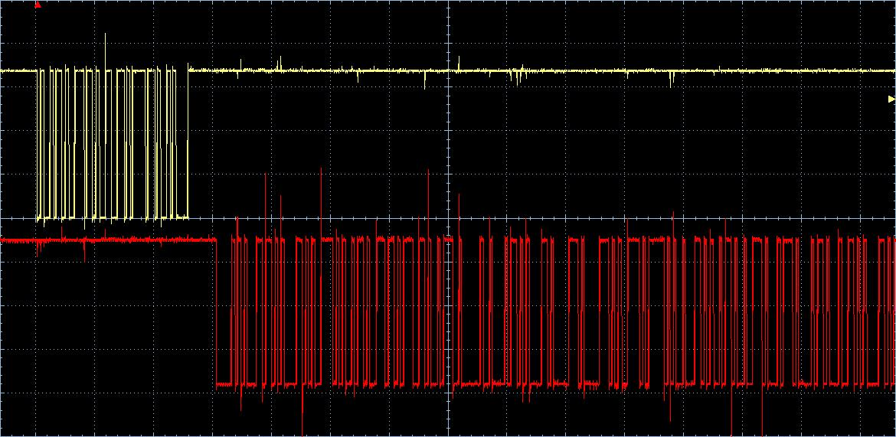

# Jukebox V1, V2, V3 y V4

## Authors

* **Pablo Morales Escandón** - email: [pablo.morales@alumnos.upm.es](mailto:pablo.morales@alumnos.upm.es)
* **Noel Solís Verdesoto** - email: [noel.solis@alumnos.upm.es](mailto:noel.solis@alumnos.upm.es)

Desarrollo de un programa capaz de reproducir melodías almacenadas en memoria usando un Buzzer controlado por la placa Nucleo-STM32 que se comunica con un ordenador a través de un módulo USART. 

Esta versión es la correspondiente al módulo 4

**Montaje actual:**

## Version 1
Desarrollo del código para un botón.

- Se desarrolla el código completo para un solo botón (el de usauario) pero preparado para la implementación de más botones.
- Se implementa además un sistema anti-rebotes (debounce).
- Se hace uso de una máquina de estados (FSM) para contolar el estado del botón.

### Common
Desarrollo de la librería common (de uso general).

* [fsm_button.h](fsm__button_8h.html).
* [fsm_button.c](fsm__button_8c.html).

Se implementa la FSM acorde a la siguiente tabla:

### Port
Desarrollo del código específico a la placa.

* [port_button.h](port__button_8h.html).
* [port_button.c](port__button_8c.html).

## Version 2
Desarrollo del código para hacer uso de la interfaz UART para recibir y enviar información al ordenador.

- Se desarrolla el código completo para la UART 3 pero preparado para la implementación de más UART si es necesario.
- Se hace uso de una máquina de estados (FSM) para contolar los estados de la UART.

### Common
Desarrollo de la librería common (de uso general).

* [fsm_usart.h](fsm__usart_8h.html).
* [fsm_usart.c](fsm__usart_8c.html).

Se implementa la FSM acorde a la siguiente tabla:

### Port
Desarrollo del código específico a la placa.

* [port_usart.h](port__usart_8h.html).
* [port_usart.c](port__usart_8c.html).

#### Demonstración comunicación por Usart
Usando el programa de test proporcionado podemos ver que la placa es capaz de detectar la pulsación del botón y enviar por la terminal serie (mediante la interfaz UART) un mensaje.

A su vez la placa es capaz de leer un mensaje enviado por el ordenador, en este caso imprime el contenido leído a la terminal.  

  

  

## Version 3
Desarrollo del código para la implementación del buzzer

- Se desarrolla el código completo para un solo buzzer pero preparada para más.
- Se hace uso de una máquina de estados (FSM) para contolar el estado del buzzer.
- Se agregan las melodías y se integran con las funcionalidades de reproducción del buzzer

### Common
Desarrollo de la librería common (de uso general).

* [fsm_buzzer.h](fsm__buzzer_8h.html).
* [fsm_buzzer.c](fsm__buzzer_8c.html).

Se implementa la FSM acorde a la siguiente tabla:

### Port
Desarrollo del código específico a la placa.

* [port_buzzer.h](port__buzzer_8h.html).
* [port_buzzer.c](port__buzzer_8c.html).

## Version 4
Desarrollo del código para la implementación del modo de bajo consumo y la integración global del sistema

- Se crea la jukebox como elemento central del sistema a través del cual se gestionan todos los demás componentes.
- Se hace uso de una máquina de estados (FSM) para contolar el estado de la jukebox.
- Se agrega un modo de bajo consumo que se activa cuando la placa se encuentra inactiva
- Se implementan diferentes comandos para la interacción con la jukebox por medio de la interfaz USART
    1. Play: Comienza o continua la reproducción de la canción seleccionada
    2. Stop: Detiene la reproducción de la canción seleccionada
    3. Pause: Pausa la reproducción de la canción seleccionada
    4. Speed: Modifica la velocidad de reproducción de la canción pudiendo tanto ralentizarla como acelerarla
    5. Next: Comienza a reproducir la siguiente canción
    6. Select: Seleciona la canción a reproducir 
    7. Info: Muestra la canción seleccionada

### Common
Desarrollo de la librería common (de uso general).

* [fsm_jukebox.h](fsm__jukebox_8h.html).
* [fsm_jukebox.c](fsm__jukebox_8c.html).

Se implementa la FSM acorde a la siguiente tabla:

### Port
Desarrollo del código específico a la placa.

* [port_jukebox.h](port__jukebox_8h.html).
* [port_jukebox.c](port__jukebox_8c.html).

#### Demonstración comunicación módulo 4
Hemos realizado la medida solicitada en el laboratorio con el osciloscopio correspondiente a una comunicación entre el ordenador y la jukebox al utilizar el comando "info"

